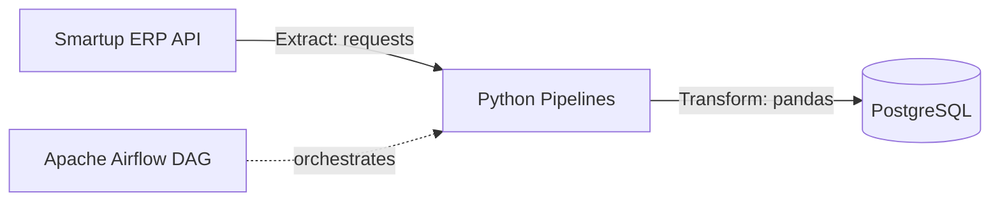
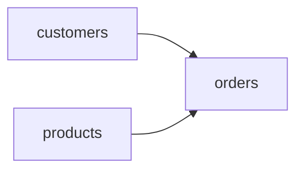

# Smartup ETL Pipeline with Apache Airflow

An automated ETL pipeline that extracts business data from the **Smartup ERP** REST API, transforms it with **Pandas**, and loads it into **PostgreSQL**. The entire workflow is orchestrated with **Apache Airflow** running in **Docker**.

---

## 🧭 Architecture



**DAG task dependency** — customers and products are extracted and loaded in parallel, followed by orders:



---

## 📦 Data Sources

| Entity | Smartup Endpoint | Description |
|---|---|---|
| Products / Inventory | `inventory$export` | Product catalog, SKUs, and inventory stock |
| Legal-Person Customers | `legal_person$export` | B2B clients, companies, and organizations |
| Natural-Person Customers | `natural_person$export` | Individual customer entities |
| Orders | `order$export` | Sales transactions, orders, and line items |

---

## 🛠 Tech Stack

- **Python 3** — `requests`, `pandas`, `SQLAlchemy`, `psycopg2`
- **Apache Airflow** — Automated orchestration, scheduling, retries, and task dependencies
- **PostgreSQL** — Target relational database / storage layer
- **Docker & Docker Compose** — Containerized environment for local deployment and services

---

## 📁 Project Structure

```text
├── config/
│   └── airflow.cfg              # Apache Airflow configuration
├── dags/
│   ├── extract.py               # Airflow DAG: task definitions and dependencies
│   └── pipelines/
│       ├── auth.json            # Smartup API credentials & DB config (gitignored)
│       ├── client.py            # API client: handles HTTP requests and pagination
│       ├── config.py            # Endpoints, request headers, and DB parameters
│       ├── customers.py         # Customer data extraction and transformation
│       ├── products.py          # Product data extraction and transformation
│       ├── orders.py            # Orders and sales data extraction and transformation
│       └── load.py              # PostgreSQL database loader module
├── docker-compose.yaml          # Multi-container Airflow setup
└── .env                         # Environment variables for Docker Compose
```

---

## ⚙️ Key Features

- **Robust Error Handling** — Failed API calls return an empty DataFrame instead of failing the entire DAG run.
- **Automatic Retries** — Configured task retries with backoff delays to handle network timeouts or API rate limits.
- **Parallel Execution** — Independent entities (`customers` and `products`) run concurrently before the `orders` task.
- **Secure Credentials** — Sensitive secrets live in `auth.json` and `.env`, both kept out of version control.

---

## 🚀 Getting Started

### 1. Clone the repository
```bash
git clone https://github.com/MatchanovDeveloper/smartup-etl-test.git
cd smartup-etl-test
```

### 2. Configure Environment & Credentials
Set up your `.env` file for Airflow:
```bash
echo -e "AIRFLOW_UID=$(id -u)\nAIRFLOW_PROJ_DIR=." > .env
```

Create and configure `dags/pipelines/auth.json` with your credentials:
```json
{
  "api": {
    "base_url": "https://api.smartup.uz/",
    "token": "YOUR_SMARTUP_API_TOKEN"
  },
  "database": {
    "host": "postgres",
    "port": 5432,
    "user": "airflow",
    "password": "YOUR_DB_PASSWORD",
    "database": "smartup_db"
  }
}
```

### 3. Start Airflow Containers
```bash
docker compose up -d
```

### 4. Trigger the DAG
1. Open your browser and navigate to `http://localhost:8080`.
2. Log in with your Airflow credentials (default: `airflow` / `airflow`).
3. Locate the **`extract`** DAG, unpause it, and trigger the execution.

---

## 👤 Author

**Matchanboy Matchanov**  
GitHub: [@MatchanovDeveloper](https://github.com/MatchanovDeveloper)